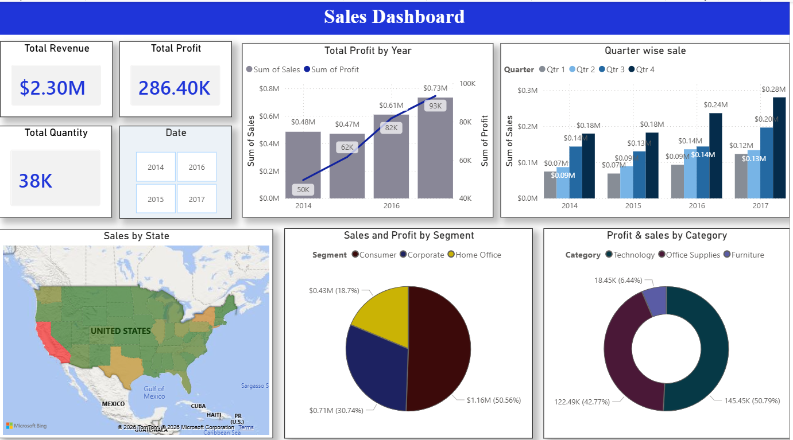

A comprehensive Power BI data analysis project evaluating US Superstore retail performance (2014-2017) to identify profitability drivers, regional trends, and category-level growth.

# 📊 Superstore Sales Insight – Power BI Analysis

A comprehensive Power BI data analysis project evaluating US Superstore retail performance (2014-2017) to identify profitability drivers, regional trends, and category-level growth **Power BI, DAX, and Power Query**.

---

## 🚀 Project Overview

This project demonstrates a real-world retail analytics workflow — analyzing **$2.30M in sales** to uncover patterns related to revenue growth, regional profitability, and product-level inefficiencies. 

The goal was to answer a critical business question: *Which segments and products are truly driving profit, and where are we losing money due to excessive discounting?*

---

## 🛠️ Technical Skills Demonstrated

- **Business Intelligence:** Power BI (Desktop & Service)
- **Data Modeling:** Star Schema, Relationship Management
- **DAX Formulas:** Calculated Measures, Time Intelligence (YoY Growth), Filtering
- **Data Transformation:** Power Query (ETL), Data Cleaning, Type Conversion
- **Analytics:** Trend Detection, Geographic Analysis, Product Portfolio Pruning
- **Reporting:** Interactive Slicers, Tooltips, Conditional Formatting

---

## 🔄 Project Workflow

### 🔹 Phase 1: Data ETL & Transformation (Power Query)
- **Data Cleaning:** Handled missing values and standardized address fields for accurate mapping.
- **Feature Engineering:** Created calculated columns for `Shipping Duration` and `Profit Margin %`.
- **Date Table:** Generated a custom Calendar table to support complex **Time Intelligence** DAX functions.

### 🔹 Phase 2: Data Modeling
- Established a robust data model to link Customers, Products, Regions, and Orders.
- Optimized the model for performance to ensure fast filtering across **38K rows** of data.

### 🔹 Phase 3: Data Visualization (Power BI)
- **Page 1: Executive Overview:** High-level KPIs and annual sales trends.
- **Page 2: Regional Performance:** Map-based visuals identifying loss-making states like Texas and Illinois.
- **Page 3: Category Deep-Dive:** Analysis of sub-category performance (e.g., Technology vs. Furniture).

---

## 📊 Key Business Insights

| Insight | Description |
|--------|------------|
| 💰 **The Profit Gap** | Total Revenue is **$2.30M**, but Profit is **$286.4K** (~12.5% margin). |
| 📈 **Growth Trend** | Sales and profit show consistent YoY growth, peaking in **2017**. |
| 🛍️ **Segment Leader** | The **Consumer segment** contributes ~50% of total revenue. |
| ❌ **Profit Bleeders** | The **Tables** and **Bookcases** sub-categories are consistently unprofitable. |
| 📍 **Geo-Risks** | High sales in Texas and Florida are negated by high operational/discount costs. |

---

## 🖼️ Dashboard Preview

### 🔹 Executive Overview and Sales Trends

### 🔹 Regional and State-Level Profitability Mapping

### 🔹 Category & Sub-Category Analysis

---

## 💡 Strategic Recommendations

1. **Optimize Discounting:** Reduce discounts on low-profit products like Tables to prevent negative margins.
2. **Promote High-Margins:** Increase marketing focus on the **Technology** category (Accessories & Copiers).
3. **Regional Strategy:** Investigate supply chain costs in the South region to fix the "High Sales, Low Profit" issue.

---

## 📂 Repository Contents

- `superstore_sales.pbix`: The primary Power BI dashboard file.
- `Superstore_Report.pdf`: Comprehensive analysis report.
- `Superstore_Presentation.pptx`: Presentation slides for stakeholders.
- `/images`: Dashboard screenshots for documentation.

---

## 👤 Author: Tarakuzzaman Faysal

**Data Science & Machine Learning Enthusiast**

- **LinkedIn:** [Tarakuzzaman Faysal](https://www.linkedin.com/in/tfaysal/)
- **GitHub:** [@tarakuzzaman-faysal](https://github.com/iamfosu)

---
⭐ *If you find this project useful, consider giving it a star on GitHub!*
